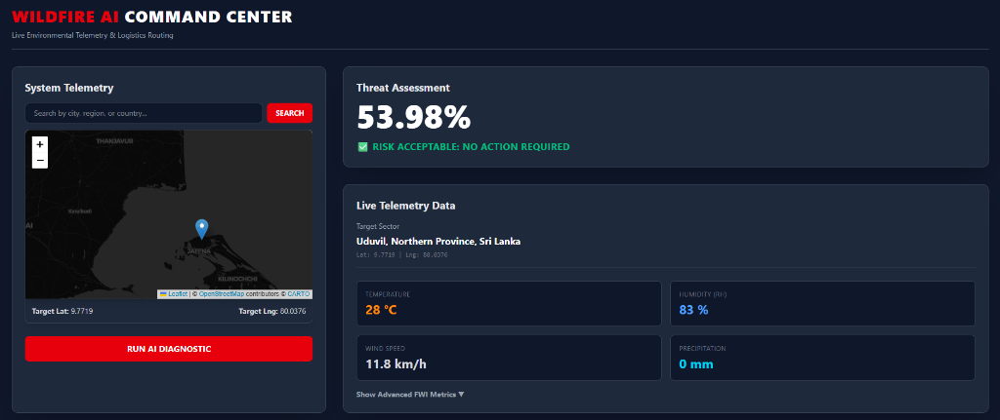
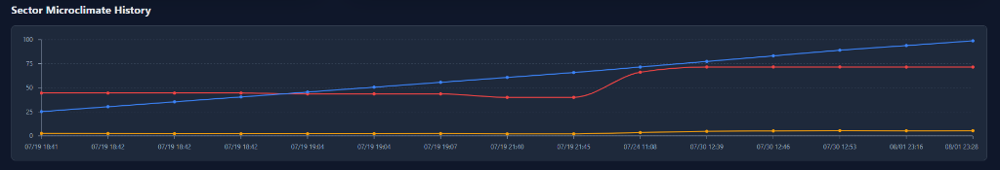

# Wildfire Risk Prediction & Resource Deployment System





An intelligent AI-powered system designed to predict wildfire risks and optimize resource deployment and routing for emergency response teams.

## Overview

This project consists of two main components:
1. **Backend Engine**: A robust FastAPI backend combining Deep Learning (PyTorch), Fuzzy Logic (`skfuzzy`), and Graph Theory (`networkx`).
2. **Frontend Dashboard**: A responsive modern web dashboard built with React, Vite, and Tailwind CSS.

### Key Features
- **Machine Learning Prediction**: Utilizes a trained PyTorch neural network to predict the probability of a wildfire based on meteorological and environmental parameters.
- **Fuzzy Logic Expert System**: Evaluates the neural network's probability output alongside wind speed to calculate a human-readable, actionable `risk_level` (Safe, Watch, Alert, Evacuate).
- **Logistics & Routing**: Uses graph algorithms (NetworkX) to determine the fastest deployment route for emergency vehicles from fire stations to the risk zone.
- **Interactive Dashboard**: Provides a seamless user interface for operators to input environmental data and receive instant risk assessments and routing instructions.
- **Real-Time Alerts**: Automated critical wildfire threat alerts via Telegram, complete with risk levels and evacuation logistics.
- **Explainable AI (XAI)**: Integrated SHAP values to determine and display the primary driving factors behind high-risk predictions.
- **Vegetation Indexing (NDVI)**: Fetches and processes satellite vegetation data for accurate environmental modeling.
- **Telemetry & Logging**: Robust SQLite database logging (SQLAlchemy) of telemetry data and error tracking using Sentry.

## Project Structure

```
Wildfire_AI_Project/
├── 1_Data_Exploration.ipynb               # Jupyter notebook for initial data analysis and modeling
├── Algerian_forest_fires_dataset_*.csv    # Datasets used for training the model
├── app.py                                 # Main FastAPI backend application
├── models.py & database.py                # SQLAlchemy database models and setup
├── telegram_alert.py                      # Telegram notification integration
├── sentry.py                              # Sentry error tracking and telemetry
├── ndvi_service.py & vegetation_*.py      # NDVI processing and data providers
├── fwi_calculator.py                      # Fire Weather Index (FWI) calculations
├── wildfire_production_model.pth          # Pre-trained PyTorch neural network weights
├── wildfire_scaler.pkl                    # Scikit-learn scaler for data normalization
├── venv/                                  # Python virtual environment (if created locally)
└── wildfire-dashboard/                    # Frontend React/Vite application
    ├── src/                               # React components and styling
    ├── package.json                       # Node.js dependencies
    └── ...
```

## Setup Instructions

### Prerequisites
- Python 3.8+
- Node.js (for the frontend)

### 1. Backend Setup

Navigate to the project root and create a virtual environment:
```bash
python -m venv venv
```

Activate the virtual environment:
- **Windows**: `venv\Scripts\activate`
- **macOS/Linux**: `source venv/bin/activate`

Install the required Python dependencies:
```bash
pip install fastapi uvicorn torch networkx scikit-learn scikit-fuzzy joblib pandas numpy sqlalchemy httpx shap apscheduler python-dotenv sentry-sdk
```

Create a `.env` file in the root directory for configuration:
```env
TELEGRAM_TOKEN=your_telegram_bot_token
CHAT_ID=your_telegram_chat_id
# Add Sentry DSN if applicable
```

Run the FastAPI server:
```bash
python app.py
```
*The backend will run on `http://127.0.0.1:8000` (or `http://localhost:8000`).*

### 2. Frontend Setup

Open a new terminal, navigate to the dashboard directory:
```bash
cd wildfire-dashboard
```

Install the Node.js dependencies:
```bash
npm install
```

Start the Vite development server:
```bash
npm run dev
```
*The frontend dashboard will be accessible via the local URL provided by Vite (usually `http://localhost:5173`).*

## API Endpoints

- `POST /predict_risk`: Accepts environmental data (Temperature, RH, Ws, Rain, FFMC, DMC, DC, ISI, BUI, FWI), scales it, passes it through the PyTorch model, evaluates risk via Fuzzy Logic, and calculates the optimal route. Returns a comprehensive JSON response with prediction, risk level, and routing information.

## Technologies Used
- **Backend**: Python, FastAPI, Uvicorn, SQLAlchemy, SQLite
- **AI / ML**: PyTorch, Scikit-learn, Scikit-Fuzzy (Fuzzy Logic Expert System), SHAP (Explainable AI)
- **Algorithms**: NetworkX (Dijkstra's Algorithm / Graph Routing)
- **Integrations**: Telegram API (Alerts), Sentry (Telemetry), Open-Meteo (Weather API)
- **Frontend**: React, Vite, Tailwind CSS, Axios
- **Data**: Based on the Algerian Forest Fires Dataset
